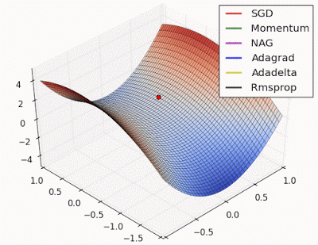
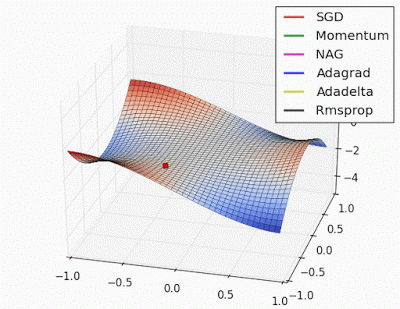

class: title
## NPFL114, Lecture 02

# Training Neural Networks

.author[
Milan Straka
]

---
# Neural Networks Web Browser Demos

- [Recognizing Hand-written Digits](https://erkaman.github.io/regl-cnn/src/demo.html)

- [DeepLearn.js Demos](https://deeplearnjs.org/index.html#demos)
  - [DeepLearn.js Image Style Transfer Demo](https://reiinakano.github.io/fast-style-transfer-deeplearnjs/)

- [TensorFlow Playground](http://playground.tensorflow.org/)

- [Quick, Draw!](https://quickdraw.withgoogle.com/)

- [Sketch RNN Demo](https://magenta.tensorflow.org/assets/sketch_rnn_demo/index.html)

---
# Maximum Likelihood Estimation

Let $\mathbb X = \\{→x^{(1)}, →x^{(2)}, \ldots, →x^{(m)}\\}$ be training data drawn
independently from data generating distribution $p\_\textrm{data}$. We denote
the empirical data distribution as $\hat p\_\textrm{data}$.

Let $p\_\textrm{model}(→x; →θ)$ be a family of distributions. The
*maximum likelihood estimation* of parameters $→θ$ is:

$$\begin{aligned}
→θ\_\mathrm{ML} &= \argmax\_→θ p\_\textrm{model}(\mathbb X; →θ) \\\
                &= \argmax\_→θ ∏\nolimits\_{i=1}^m p\_\textrm{model}(→x^{(i)}; →θ) \\\
                &= \argmin\_→θ ∑\nolimits\_{i=1}^m -\log p\_\textrm{model}(→x^{(i)}; →θ) \\\
                &= \argmin\_→θ \mathbb E\_{⁇→x ∼ \hat p\_\textrm{data}} [-\log p\_\textrm{model}(→x^{(i)}; →θ)] \\\
                &= \argmin\_→θ H(\hat p\_\textrm{data}, p\_\textrm{model}(→x; →θ)) \\\
                &= \argmin\_→θ D\_\textrm{KL}(\hat p\_\textrm{data}||p\_\textrm{model}(→x; →θ)) \color{gray} + H(\hat p\_\textrm{data})
\end{aligned}$$

---
# Maximum Likelihood Estimation

Easily generalized to situations where our goal is predict $y$ given $→x$.
$$\begin{aligned}
→θ\_\mathrm{ML} &= \argmax\_→θ p\_\textrm{model}(\mathbb Y | \mathbb X; →θ) \\\
                &= \argmax\_→θ ∏\nolimits\_{i=1}^m p\_\textrm{model}(y^{(i)} | →x^{(i)}; →θ) \\\
                &= \argmin\_→θ ∑\nolimits\_{i=1}^m -\log p\_\textrm{model}(y^{(i)} | →x^{(i)}; →θ) \\\
\end{aligned}$$

The resulting _loss function_ called _negative log likelihood_, or
_cross-entropy_ or _Kullback-Leibler divegence_.

---
# Mean Square Error as MLE

Assume our goal is to perform a regression, i.e., to predict $p(y | →x)$ for $y ∈ ℝ$.

Let $\hat y(→x; →θ)$ gives the prediction of mean of $y$.

We define $p(y | →x)$ as $\N(y; \hat y(→x; →θ), σ^2)$ for a given fixed $σ$.
Then:
$$\begin{aligned}
\argmax\_→θ p(y | →x; →θ) =& \argmin\_→θ ∑\_{i=1}^m -\log p(y^{(i)} | →x^{(i)} ; →θ) \\\
                          =& \argmin\_→θ ∑\_{i=1}^m -\log \sqrt{\frac{1}{2πσ^2}} \exp
                             \left(-\frac{(y^{(i)} - \hat y(→x^{(i)}; →θ))^2}{2σ^2}\right) \\\
                          =& -m \log σ - \frac{m}{2} \log 2π \\\
                           & - \argmin\_→θ ∑\_{i=1}^m -\frac{||y - \hat y(→x; →θ)||^2}{2σ^2} \\\
                          =& \argmin\_→θ ∑\_{i=1}^m \frac{||y - \hat y(→x; →θ)||^2}{2σ^2} \\\
\end{aligned}$$

---
# Adaptive Optimizers Animations

---
# Adaptive Optimizers Animations

---
# Adaptive Optimizers Animations

---
# Adaptive Optimizers Animations

