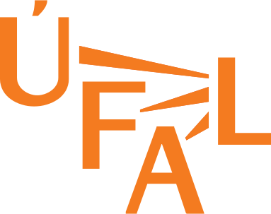
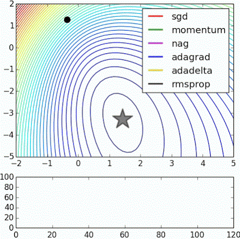
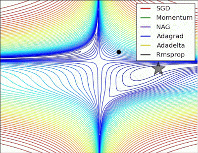

class: title
## NPFL114, Lecture 02

# Training Neural Networks

.author[
Milan Straka
]

---
# Machine Learning Basics

We usually have a **training set**, which is assumed to consist of examples
generated independently from a **data generating distribution**.

The goal of optimization is to match the training set as good as possible.

--

However, the main goal of machine learning is to perform well on _previously
unseen_ data, so called **generalization error** or **test error**. We typically
estimate the generalization error using a **test set** of examples independent
of the training set.

---
# Machine Learning Basics

Challenges in machine learning:
- _underfitting_

- _overfitting_

--

---
# Machine Learning Basics

We control whether a model underfits or overfits by modifying its _capacity_.
(representational capacity, effective capacity).

--

--

The **No free lunch theorem** (Wolpert, 1996) states that averaging over
all possible data distributions, every classification algorithm achieves
same error when processing previously unseen examples. In a sense, no machine
learning algorithm is universally better than any other.

---
# Machine Learning Basics

Any change in the machine learning algorithm that is designed to reduce
generalization error but not necessarily its training error is called
**regularization**.

--

$L\_2$ regularization (also called weighted decay) penalizes models
with large weights (i.e., penalty of $||→θ||^2$).

---
# Machine Learning Basics

_Hyperparameters_ are not adapted by learning algorithm itself.

Usually a **validation set** or **development set** is used to
estimate generalization error, allowing to update hyperparameters accordingly.

---
# Loss Function

A model is usually trained in order to minimize a _loss_ on the training data.

--

Assuming that a model computes $f(→x;→θ)$ using parameters $→θ$,
_mean square error_ is computed as $$∑\_i \left(f(→x^{(i)}; →θ) - y^{(i)}\right)^2.$$

--

A common principle used to design loss functions is _maximum likelihood
principle_.

---
# Maximum Likelihood Estimation

Let $\mathbb X = \\{→x^{(1)}, →x^{(2)}, \ldots, →x^{(m)}\\}$ be training data drawn
independently from data generating distribution $p\_\textrm{data}$. We denote
the empirical data distribution as $\hat p\_\textrm{data}$.

Let $p\_\textrm{model}(→x; →θ)$ be a family of distributions. The
*maximum likelihood estimation* of parameters $→θ$ is:

$$\begin{aligned}
→θ\_\mathrm{ML} &= \argmax\_→θ p\_\textrm{model}(\mathbb X; →θ) \\\
                &= \argmax\_→θ ∏\nolimits\_{i=1}^m p\_\textrm{model}(→x^{(i)}; →θ) \\\
                &= \argmin\_→θ ∑\nolimits\_{i=1}^m -\log p\_\textrm{model}(→x^{(i)}; →θ) \\\
                &= \argmin\_→θ \mathbb E\_{⁇→x ∼ \hat p\_\textrm{data}} [-\log p\_\textrm{model}(→x; →θ)] \\\
                &= \argmin\_→θ H(\hat p\_\textrm{data}, p\_\textrm{model}(→x; →θ)) \\\
                &= \argmin\_→θ D\_\textrm{KL}(\hat p\_\textrm{data}||p\_\textrm{model}(→x; →θ)) \color{gray} + H(\hat p\_\textrm{data})
\end{aligned}$$

---
# Maximum Likelihood Estimation

Easily generalized to situations where our goal is predict $y$ given $→x$.
$$\begin{aligned}
→θ\_\mathrm{ML} &= \argmax\_→θ p\_\textrm{model}(\mathbb Y | \mathbb X; →θ) \\\
                &= \argmax\_→θ ∏\nolimits\_{i=1}^m p\_\textrm{model}(y^{(i)} | →x^{(i)}; →θ) \\\
                &= \argmin\_→θ ∑\nolimits\_{i=1}^m -\log p\_\textrm{model}(y^{(i)} | →x^{(i)}; →θ) \\\
\end{aligned}$$

The resulting _loss function_ called _negative log likelihood_, or
_cross-entropy_ or _Kullback-Leibler divegence_.

---
# Mean Square Error as MLE

Assume our goal is to perform a regression, i.e., to predict $p(y | →x)$ for $y ∈ ℝ$.

Let $\hat y(→x; →θ)$ gives the prediction of mean of $y$.

We define $p(y | →x)$ as $\N(y; \hat y(→x; →θ), σ^2)$ for a given fixed $σ$.
Then:
$$\begin{aligned}
\argmax\_→θ p(y | →x; →θ) =& \argmin\_→θ ∑\_{i=1}^m -\log p(y^{(i)} | →x^{(i)} ; →θ) \\\
                          =& \argmin\_→θ ∑\_{i=1}^m -\log \sqrt{\frac{1}{2πσ^2}}
                            e ^ {\normalsize -\frac{(y^{(i)} - \hat y(→x^{(i)}; →θ))^2}{2σ^2}} \\\
                          =& -m \log σ - \frac{m}{2} \log 2π \\\
                           & - \argmin\_→θ ∑\_{i=1}^m -\frac{||y - \hat y(→x; →θ)||^2}{2σ^2} \\\
                          =& \argmin\_→θ ∑\_{i=1}^m \frac{||y - \hat y(→x; →θ)||^2}{2σ^2} \\\
\end{aligned}$$

---
# Gradient Descent

Let a model compute $f(→x;→θ)$ using parameters $→θ$. In order to compute $J(→θ)
= \argmin\_→θ 𝔼\_{(→x, y)∼\hat p\_\textrm{data}} L(f(→x; →θ), y)$, we may use _gradient descent_:
$$→θ ← →θ - α∇\_→θJ(→θ)$$

## Gradient Descent

We use all training data to compute the $J(→θ)$.

## Online (or Stochastic) Gradient Descent

We estimate the expectation in $J(→θ)$ using a single randomly sampled example
from the training data. Such estimate is unbiased, but very noisy.

## Minibatch SGD

The minibatch SGD is a trade-off between gradient descent and SGD – the
expectation in $J(→θ)$ is estimated using $m$ random independent examples from
the training data.

---
# Gradient Descent

---
# Backpropagation

Assume we want to compute partial derivatives of a given loss function $J$ and
let $\frac{∂J}{∂z}$ be known.

$$\begin{gathered}
\frac{∂J}{∂y\_i} = \frac{∂J}{∂z} \frac{∂z}{∂y\_i} = \frac{∂J}{∂z} \frac{∂g(→y)}{∂y\_i} \\\
\frac{∂J}{∂→x\_i} = \frac{∂J}{∂z} \frac{∂z}{∂y\_i} \frac{∂y\_i}{∂→x\_i} = \frac{∂J}{∂z} \frac{∂g(→y)}{∂y\_i} \frac{∂f(→x\_i)}{∂→x\_i}
\end{gathered}$$

---
class: middle, center
# Backpropagation Example

---
class: middle, center
# Backpropagation Example

---
class: middle, center, full
# Backpropagation Example

---
class: middle
# Backpropagation Algorithm

#### Forward Propagation
.algorithm[
**Inputs**: Network with nodes $u^{(1)}, u^{(2)}, \ldots, u^{(n)}$ numbered in
topological order, each node being computed as $u^{(i)} = f^{(i)}(\mathbb A^{(i)})$
for $\mathbb A^{(i)}$ composed of values of the predecessors $P(u^{(i)})$ of
$u^{(i)}$.  
**Outputs**: Value of $u^{(n)}$.
- For $i = 1, \ldots, n$:
    - $\mathbb A^{(i)} ← \lbrace u^{(j)} | j ∈ P(u^{(i)})\rbrace$
    - $u^{(i)} ← f^{(i)}(\mathbb A^{(i)})$
- Return $u^{(n)}$
]

---
class: middle
# Backpropagation Algorithm

#### Simple Variant of Backpropagation
.algorithm[
**Inputs**: The network as in the Forward propagation algorithm. 
**Outputs**: Partial derivatives $g^{(i)} = \frac{∂u^{(n)}}{∂u^{(i)}}$ of $u^{(n)}$ with respect to all $u^{(i)}$.
- Run forward propagation to compute all $u^{(i)}$
- $g^{(n)} = 1$
- For $i = n-1, \ldots, 1$:
    - $g^{(i)} ← ∑\_{j:i∈P(u^{(j)})} g^{(j)} \frac{∂u^{(j)}}{∂u^{(i)}}$
- Return $→g$
]

In practice, we do not usually represent network as a collection of scalar
nodes; instead we represent it as a collection of tensor functions – most
usually functions $f: ℝ^n → ℝ^m$. Then $\frac{∂f(→x)}{∂→x}$ is a Jacobian.
However, the backpropagation algorithm is analogous.

---
class: center, middle
# Neural Network Architecture à la '80s

---
# Neural Network Activation Functions

## Hidden Layers Derivatives
- $σ$: $$\frac{dσ(x)}{dx} = σ(x) \cdot (1-σ(x))$$
- $\tanh$: $$\frac{d\tanh(x)}{dx} = 1 - \tanh(x)^2$$
- ReLU:
  $$ \frac{d\operatorname{ReLU}(x)}{dx} = \begin{cases} 1 &\text{if } x > 0 \\\ 0 &\text{if } x ≤ 0 \end{cases}$$

---
class: middle
# Stochastic Gradient Descent

#### Stochastic Gradient Descent (SGD) Algorithm
.algorithm[
**Inputs**: NN computing function $f(→x; →θ)$ with initial value of parameters $→θ$. 
**Inputs**: Learning rate $α$. 
**Outputs**: Updated parameters $→θ$.
- Repeat until stopping criterion is met:
    - Sample a minibatch of $m$ training examples $(→x^{(i)}, y^{(i)})$
    - $→g ← \frac{1}{m} ∇\_{→θ} ∑\_i L(f(→x^{(i)}; →θ), y^{(i)})$
    - $→θ ← →θ - α→g$
]

---
# SGD With Momentum

#### SGD With Momentum
.algorithm[
**Inputs**: NN computing function $f(→x; →θ)$ with initial value of parameters $→θ$. 
**Inputs**: Learning rate $α$, momentum $β$. 
**Outputs**: Updated parameters $→θ$.
- Repeat until stopping criterion is met:
    - Sample a minibatch of $m$ training examples $(→x^{(i)}, y^{(i)})$
    - $→g ← \frac{1}{m} ∇\_{→θ} ∑\_i L(f(→x^{(i)}; →θ), y^{(i)})$
    - $→v ← β→v - α→g$
    - $→θ ← →θ + →v$
]

---
# SGD With Nesterov Momentum

#### SGD With Nesterov Momentum
.algorithm[
**Inputs**: NN computing function $f(→x; →θ)$ with initial value of parameters $→θ$. 
**Inputs**: Learning rate $α$, momentum $β$. 
**Outputs**: Updated parameters $→θ$.
- Repeat until stopping criterion is met:
    - Sample a minibatch of $m$ training examples $(→x^{(i)}, y^{(i)})$
    - $→θ ← →θ + β→v$
    - $→g ← \frac{1}{m} ∇\_{→θ} ∑\_i L(f(→x^{(i)}; →θ), y^{(i)})$
    - $→v ← β→v - α→g$
    - $→θ ← →θ - α→g$
]

---
class: middle
# Algorithms with Adaptive Learning Rates

#### AdaGrad (2011)
.algorithm[
**Inputs**: NN computing function $f(→x; →θ)$ with initial value of parameters $→θ$. 
**Inputs**: Learning rate $α$, constant $ε$ (usually $10^{-8}$). 
**Outputs**: Updated parameters $→θ$.
- Repeat until stopping criterion is met:
    - Sample a minibatch of $m$ training examples $(→x^{(i)}, y^{(i)})$
    - $→g ← \frac{1}{m} ∇\_{→θ} ∑\_i L(f(→x^{(i)}; →θ), y^{(i)})$
    - $→r ← →r + →g^2$
    - $→θ ← →θ - \frac{α}{\sqrt{→r + ε}}→g$
]

---
class: middle
# Algorithms with Adaptive Learning Rates

#### RMSProp (2012)
.algorithm[
**Inputs**: NN computing function $f(→x; →θ)$ with initial value of parameters $→θ$. 
**Inputs**: Learning rate $α$, momentum $β$, constant $ε$ (usually $10^{-8}$). 
**Outputs**: Updated parameters $→θ$.
- Repeat until stopping criterion is met:
    - Sample a minibatch of $m$ training examples $(→x^{(i)}, y^{(i)})$
    - $→g ← \frac{1}{m} ∇\_{→θ} ∑\_i L(f(→x^{(i)}; →θ), y^{(i)})$
    - $→r ← β→r + (1-β)→g^2$
    - $→θ ← →θ - \frac{α}{\sqrt{→r + ε}}→g$
]

---
# Algorithms with Adaptive Learning Rates

#### Adam (2014)
.algorithm[
**Inputs**: NN computing function $f(→x; →θ)$ with initial value of parameters $→θ$. 
**Inputs**: Learning rate $α$ (default 0.001), constant $ε$ (usually $10^{-8}$). 
**Inputs**: Momentum $β\_1$ (default 0.9), momentum $β\_2$ (default 0.999). 
**Outputs**: Updated parameters $→θ$.
- $→s ← 0$, $→r ← 0$, $t ← 0$
- Repeat until stopping criterion is met:
    - Sample a minibatch of $m$ training examples $(→x^{(i)}, y^{(i)})$
    - $→g ← \frac{1}{m} ∇\_{→θ} ∑\_i L(f(→x^{(i)}; →θ), y^{(i)})$
    - $t ← t + 1$
    - $→s ← β\_1→s + (1-β\_1)→g$ _(biased first moment estimate)_
    - $→r ← β\_2→r + (1-β\_2)→g^2$ _(biased second moment estimate)_
    - $\hat→s ← →s / (1 - β\_1^t)$
    - $\hat→r ← →r / (1 - β\_2^t)$
    - $→θ ← →θ - \frac{α}{\sqrt{\hat→r + ε}}\hat→s$
]

---
# Algorithms with Adaptive Learning Rates

#### Adam (2014)
.algorithm[
**Inputs**: NN computing function $f(→x; →θ)$ with initial value of parameters $→θ$. 
**Inputs**: Learning rate $α$ (default 0.001), constant $ε$ (usually $10^{-8}$). 
**Inputs**: Momentum $β\_1$ (default 0.9), momentum $β\_2$ (default 0.999). 
**Outputs**: Updated parameters $→θ$.
- $→s ← 0$, $→r ← 0$, $t ← 0$
- Repeat until stopping criterion is met:
    - Sample a minibatch of $m$ training examples $(→x^{(i)}, y^{(i)})$
    - $→g ← \frac{1}{m} ∇\_{→θ} ∑\_i L(f(→x^{(i)}; →θ), y^{(i)})$
    - $t ← t + 1$
    - $→s ← β\_1→s + (1-β\_1)→g$ _(biased first moment estimate)_
    - $→r ← β\_2→r + (1-β\_2)→g^2$ _(biased second moment estimate)_
    - $α\_t ← α \sqrt{1 - β\_2^t} / (1-β\_1^t)$
    - $→θ ← →θ - \frac{α\_t}{\sqrt{→r + ε}}→s$
]

---
# Adam Bias Correction

After $t$ steps, we have $$→r\_t = (1 - β\_2) ∑\_{i=1}^t β\_2^{t-i}→g\_i^2.$$

Assuming that the second moment $𝔼[→g\_i^2]$ is stationary, we have
$$\begin{aligned}
𝔼[→r\_t] &=  𝔼\left[(1 - β\_2) ∑\_{i=1}^t β\_2^{t-i}→g\_i^2\right] \\\
         &=  𝔼[→g\_t^2] \cdot (1 - β\_2) ∑\_{i=1}^t β\_2^{t-i} \\\
         &=  𝔼[→g\_t^2] \cdot (1 - β\_2^t)
\end{aligned}$$

and analogously for correction of $→s$.

---
# Adaptive Optimizers Animations

---
# Adaptive Optimizers Animations

---
# Adaptive Optimizers Animations

---
# Adaptive Optimizers Animations

