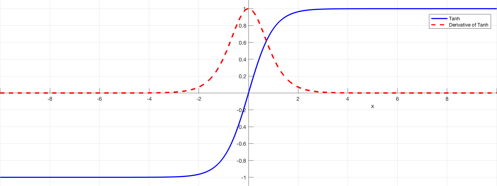
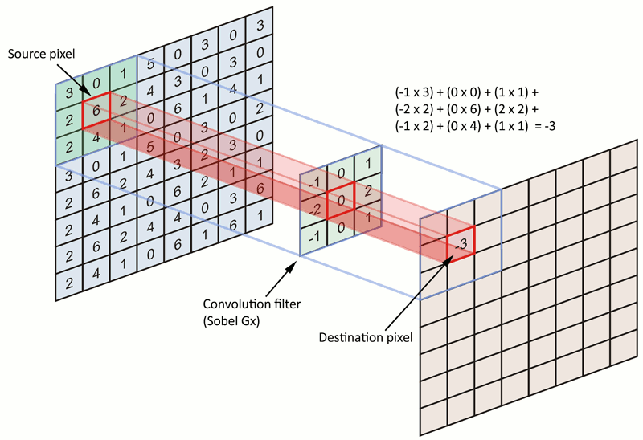
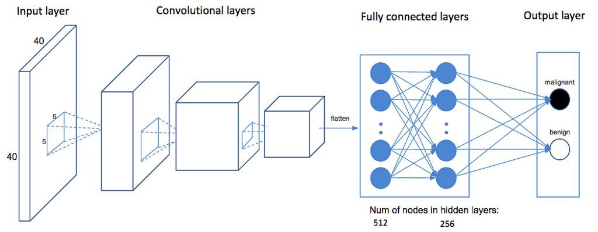

class: title
## NPFL114, Lecture 03

# Training Neural Networks II

.author[
Milan Straka
]

---
# Putting It All Together

Let us have a dataset with a training, validation and test sets, each containing
examples $(→x, y)$. Depending on $y$, consider one of the following output
activation functions:
$$\begin{cases}
  \textrm{none} & \textrm{ if } y ∈ ℝ\\\
  σ & \textrm{ if } y \textrm{ is a probability of an outcome}\\\
  \softmax & \textrm{ if } y \textrm{ is a gold class}
\end{cases}$$

If $→x ∈ ℝ^d$, we can use a neural network with an input layer of size $d$,
hidden layer of size $h$ with a non-linear activation function, and an output
layer of size $o$ (either 1 or number of classification classes) with the
mentioned output function.

---
layout: true
# Putting It All Together

---

We have $$h\_i = f^{(1)}\left(∑\_j ⇉W^{(1)}\_{i,j} x\_j + b^{(1)}\_i\right)$$
where $⇉W^{(1)} ∈ ℝ^\{h×d}$ is a matrix of weights, $→b^{(1)} ∈ ℝ^h$ is a vector of biases,
and $f^{(1)}$ is an activation function.

---

Similarly $$o\_i = f^{(2)}\left(∑\_j ⇉W^{(2)}\_{i,j} h\_j + b^{(2)}\_i\right)$$
with $⇉W^{(2)} ∈ ℝ^\{o×h}$ another matrix of weights, $→b^{(2)} ∈ ℝ^o$ another vector of biases,
and $f^{(2)}$ being an output activation function.

---
layout: false
# Putting It All Together

The parameters of the model are therefore $⇉W^{(1)}, ⇉W^{(2)}, →b^{(1)}, →b^{(2)}$ of total size
$d×h + h×o + h + o$.

To train the network, we repeatedly sample $m$ training examples and perform
SGD (or any its adaptive variant), updating the parameters to minimize the
loss.

--

$$θ\_i ← θ\_i - α\frac{∂L}{∂θ\_i}$$

--

We set the hyperparameters (size of the hidden layer, hidden layer activation
function, learning rate, …) using performance on the validation set and evaluate
generalization error on the test set.

---
# Practical Issues

- Processing all input in _batches_.

--

- Vector representation of the network.

--

  Considering $h\_i = f^{(1)}\left(∑\_j ⇉W^{(1)}\_{i,j} x\_j + b^{(1)}\_i\right)$,
  we can write $$→h = f^{(1)}\left(⇉W^{(1)} →x + →b^{(1)}\right)$$
  $$→o = f^{(2)}\left(⇉W^{(2)} →h + →b^{(2)}\right) = f^{(2)}\left(⇉W^{(2)} \left(f^{(1)}\left(⇉W^{(1)} →x + →b^{(1)}\right)\right) + →b^{(2)}\right)$$

--

  The derivatives $$\frac{∂f^{(1)}\left(⇉W^{(1)} →x + →b^{(1)}\right)}{∂⇉W^{(1)}}$$
  are then matrices (called _Jacobians_).

---
class: center
# Computation Graph

$↓$

---
# Neural Networks Web Browser Demos

- [TensorFlow Playground](http://playground.tensorflow.org/)

- [Sketch RNN Demo](https://magenta.tensorflow.org/assets/sketch_rnn_demo/index.html)

- [DeepLearn.js Demos](https://deeplearnjs.org/index.html#demos)
  - [DeepLearn.js Image Style Transfer Demo](https://reiinakano.github.io/fast-style-transfer-deeplearnjs/)

---
class: middle, tablebig
# High Level Overview

|                 | Classical ('90s) | Deep Learning |
|-----------------|------------------|---------------|
|Architecture     | $\vdots\,\,\vdots\,\,\vdots$ | $\vdots\,\,\vdots\,\,\vdots\,\,\vdots\,\,\vdots\,\,\vdots\,\,\vdots\,\,\vdots\,\,\vdots\,\,\vdots$ &nbsp; CNN, RNN, VAE, GAN, …
|Activation func. | $\tanh, σ$    | $\tanh$, ReLU, PReLU, ELU, SELU, Swish, …
|Output function  | none, $σ$     | none, $σ$, $\softmax$
|Loss function    | MSE           | NLL (or cross-entropy or KL-divergence)
|Optimalization   | SGD, momentum | SGD, RMSProp, Adam, …
|Regularization   | L2, L1        | L2, Dropout, BatchNorm, LayerNorm, …

---
# MLE Loss of Softmax

Let us have a softmax output layer with
$$o\_i = \frac{e^{z\_i}}{∑\_j e^{z\_j}}.$$

---
# MLE Loss of Softmax

Consider now the MLE estimation. The loss $L(\softmax(→z), \textit{gold})$ for
gold class index $\textit{gold}$ is then $$L(\softmax(→z), \textit{gold}) = - \log o\_\textit{gold}.$$

The derivation of the loss with respect to $→z$ is then
$$\begin{aligned}
\frac{∂L}{∂z\_i} =& \frac{∂}{∂z\_i} \left[-\log \frac{e^{z\_\textit{gold}}}{∑\_j e^{z\_j}}\right] \\\
                 =& -\frac{∂z\_\textit{gold}}{∂z\_i} + \frac{∂\log(∑\_j e^{z\_j})}{∂z\_i} \\\
                 =& -[\textit{gold} = i] + \frac{1}{∑\_j e^{z\_j}} e^{z\_i} \\\
                 =& -[\textit{gold} = i] + o\_i.
\end{aligned}$$

Therefore, $\frac{∂L}{∂→z} = - →1\_\textit{gold} + →o$, where $→1\_\textit{gold}$
is 1 at index $\textit{gold}$ and 0 otherwise.

---
# MLE Loss of Softmax and Sigmoid

In the previous case, the gold distribution was _sparse_, with only one
probability being 1.

In the case of general gold distribution $→g$, we have
$$L(\softmax(→z), →g) = -∑\_i g\_i \log o\_i.$$ Adapting the previous procedure,
we obtain
$$\frac{∂L}{∂→z} = -→g + →o.$$

--

## Sigmoid

Analogously, for $o = σ(z)$ we get $\frac{∂L}{∂z} = -g + o$,
where $g$ is the target gold probability.

---
# Regularization

As already mentioned, regularization is any change in the machine learning
algorithm that is designed to reduce generalization error but not necessarily
its training error.

Regularization is usually needed only if training error and generalization error
are different. That is often not the case if we process each training example
only once. Generally the more training data, the better generalization
performance.

- Early stopping

- L2, L1 regularization

- Dataset augmentation

- Ensembling

- Dropout

---
class: middle
# Regularization – Early Stopping

---
# L2 Regularization

We prefer models with parameters small under L2 metric.

The L2 regularization, also called _weight decay_, _Tikhonov regularization_ or
_ridge regression_ therefore minimizes
$$\tilde J(→θ; \mathbb X) = J(→θ; \mathbb X) + λ ||→θ||\_2^2$$
for a suitable (usually very small) $λ$.

During the parameter update of SGD, we get
$$θ\_i ← θ\_i - α\frac{∂J}{∂θ\_i} - 2αλθ\_i$$

---
class: center,middle
# L2 Regularization

---
# L2 Regularization as MAP

Another way to arrive at L2 regularization is to utilize Bayesian inference.

With MLE we have
$$→θ\_\mathrm{MLE} = \argmax\_→θ p(\mathbb X; →θ).$$

Instead, we may want to maximize _maximum a posteriori (MAP)_ point estimate:
$$→θ\_\mathrm{MAP} = \argmax\_→θ p(→θ; \mathbb X)$$

Using Bayes' theorem $\left[p(→θ; \mathbb X) = p(\mathbb X; →θ) p(→θ) / p(\mathbb X)\right]$, we get
$$→θ\_\mathrm{MAP} = \argmax\_→θ p(\mathbb X; →θ)p(→θ).$$

---
# L2 Regularization as MAP

The $p(→θ)$ are prior probabilities of the parameter values (our _preference_).

One possibility for such a prior is $\N(→θ; 0, σ^2)$.

Then
$$\begin{aligned}
→θ\_\mathrm{MAP} &= \argmax\_→θ p(\mathbb X; →θ)p(→θ) \\\
                 &= \argmax\_→θ ∏\nolimits\_{i=1}^m p(→x^{(i)}; →θ)p(→θ) \\\
                 &= \argmin\_→θ ∑\nolimits\_{i=1}^m -\log p(→x^{(i)}; →θ) - \log p(→θ) \\\
\end{aligned}$$

By substituting the probability of the Gaussian prior, we get
$$→θ\_\mathrm{MAP} = \argmin\_→θ ∑\_{i=1}^m -\log p(→x^{(i)}; →θ) + \frac{1}{2} \log(2πσ^2) + \frac{→θ^2}{2σ^2}$$

---
# L1 Regularization

Similar to L2 regularization, but we prefer low L1 metric of parameters. We
therefore minimize
$$\tilde J(→θ; \mathbb X) = J(→θ; \mathbb X) + λ ||→θ||\_1$$

The corresponding SGD update is then $$θ\_i ← θ\_i - α\frac{∂J}{∂θ\_i} - αλ.$$

---
# Regularization – Dataset Augmentation

For some data, it is cheap to generate slightly modified examples.

- Image processing: translations, horizontal flips, scaling, rotations, color
  adjustments, …

- Speech recognition

- More difficult for discrete domains like text.

---
# Regularization – Dataset Augmentation

- Noise injection to input examples

- Label smoothing

-  Mixup (25 Oct 2017)

---
# Regularization – Ensembling

Ensembling (also called _model averaging_ or _bagging_) is a general technique
for reducing generalization error by combining several models. The models are
usually combined by averaging their outputs (either distributions or output
values in case of regression).

---
# Regularization – Ensembling

- Generate different datasets by sampling with replacement.

- Use random different initialization.

- Average models from last hours/days of training.

---
# Regularization – Dropout

How to design good universal features?

- In reproduction, evolution is achieved using gene swapping. The genes must not
  be just good with combination with other genes, they need to be universally
  good.

--

Idea of _dropout_ by (Srivastava et al., 2014), in preprint since 2012.

When applying dropout to a layer, we drop each neuron independently with
a probability of $p$ (usually called _dropout rate_). To the rest of the
network, the dropped neurons have value of zero.

Dropout is performed only when training, during inference no nodes are
dropped. However, in that case we need to _scale the activations down_
by a factor of $1-p$ to account for more neurons than usual.

Alternatively, we might _scale the activations up_ during training by a factor
of $1/(1-p)$.

---
class: middle, center
# Regularization – Dropout as Ensembling

---
# Convergence

The training process might or might not converge. Even if it does, it might
converge slowly or quickly.

There are _many_ factors influencing convergence and its speed, we now discuss
three of them.

---
class: middle, full
# Convergence – Saturating Non-linearities

---
# Convergence – Parameter Initialization

Neural networks usually need random initialization to _break symmetry_.

- Biases are usually initialized to a constant value, usually 0.

--

- Weights are usually initialized to small random values, either with uniform or
  normal distribution.
   - The scale matters for deep networks!

   - Originally, people used $U\left[-\frac{1}{\sqrt n}, \frac{1}{\sqrt n}\right]$ distribution.

--

   - Xavier Glorot and Yoshua Bengio, 2010:
     _Understanding the difficulty of training deep feedforward neural networks_.

     Theoretically and experimentally showed that a suitable way to initialize a $ℝ^{n×m}$
     matrix is $$U\left[-\sqrt{\frac{6}{m+n}}, \sqrt{\frac{6}{m+n}}\right].$$

---
class: middle, center
# Convergence – Parameter Initialization

---
class: middle, center
# Convergence – Parameter Initialization

---
class: middle
# Convergence – Gradient Clipping

---
# Convergence – Gradient Clipping

Using a given maximum norm, we may clip the gradient.
$$g ← \begin{cases}
  g & \textrm{ if }||g|| ≤ c \\\
  c \frac{g}{||g||} & \textrm{ if }||g|| > c
\end{cases}$$

The clipping can be per weight, per matrix or for the gradient as a whole.

---
class: middle, center
# Going Deeper

# Going Deeper

---
# Convolutional Networks

Consider data with some structure (temporal data, speech, images, …).

Unlike densely connected layers, we might want:
- Sparse (local) interactions
- Parameter sharing (equal response everywhere)
- Shift invariance

---
class: middle
# Convolutional Networks

---
# Convolution Operation

For a functions $x$ and $w$, _convolution_ $x \* w$ is defined as
$$(x \* w)(t) = ∫x(a)w(t - a)\d a.$$

For vectors, we have
$$(→x \* →w)\_t = ∑\_i x\_i w\_{t-i}.$$

Convolution operation can be generalized to two dimensions by
$$(⇉I \* ⇉K)\_{i, j} = ∑\_{m, n} ⇉I\_{m, n} ⇉K\_{i-m, j-n}.$$

Closely related is _cross-corellation_, where $K$ is flipped:
$$S\_{i, j} = ∑\_{m, n} ⇉I\_{i+m, j+n} ⇉K\_{m, n}.$$

---
class: center
# Convolution

---
# Convolution Operation

The $K$ is usually called a _kernel_ or a _filter_, and we generally apply
several of them at the same time.

Consider an input image with $C$ channels. The convolution operation with
$F$ filters of width $W$, height $H$ and stride $S$ produces an output with $F$ channels
kernels of total size $W × H × C × F$ and is computed as
$$(⇉I \* ⇉K)\_{i, j, k} = ∑\_{m, n, o} ⇉I\_{i\cdot s + m, j\cdot s + n, o} ⇉K\_{m, n, o, k}.$$

--

There are multiple padding schemes, most common are:
- `valid`: we only use valid pixels, which causes the result to me smaller
- `same`: we pad original image with zero pixels so that the result is exactly
  the size of the input

---
# Pooling

Pooling is an operation similar to convolution, but we perform a fixed operation
instead of multiplying by a kernel.

- Max pooling: minor translation invariance
- Average pooling

---
# High-level CNN Architecture

We repeatedly use the following block:
1. Convolution operation
2. Non-linear activation (usually ReLU)
3. Pooling

---
class: middle
# Similarities in V1 and CNNs

The primary visual cortex recognizes Gabor functions.

---
class: middle
# Similarities in V1 and CNNs

Similar functions are recognized in the first layer of a CNN.

---
class: middle
# AlexNet

---
class: middle, center
# AlexNet

