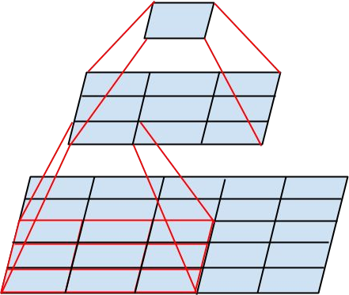
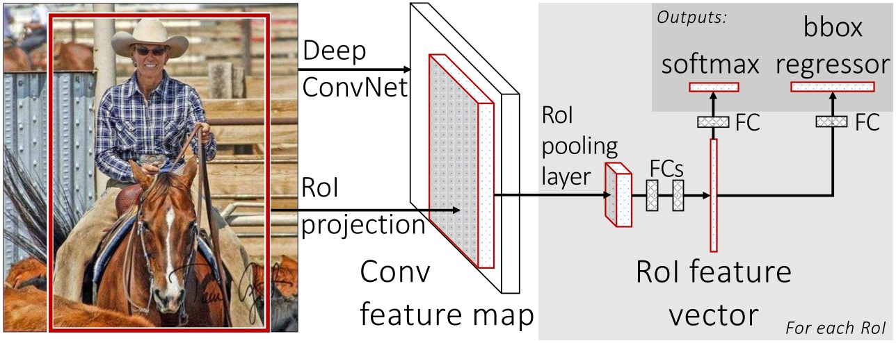
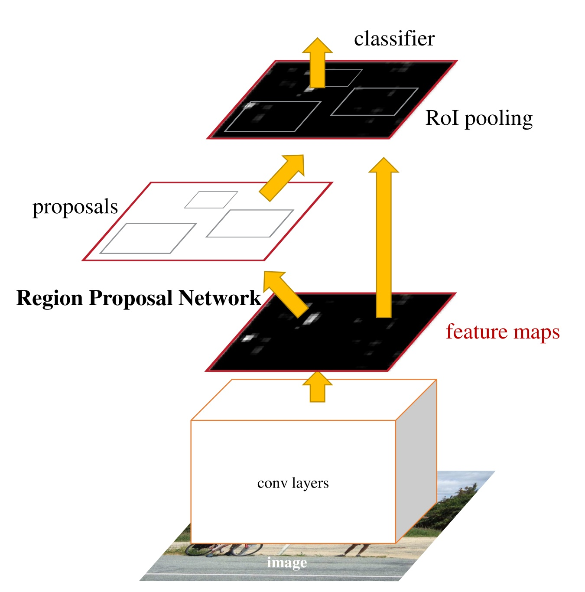

class: title
## NPFL114, Lecture 05

# Convolutional Networks II

.author[
Milan Straka
]

---
# Convolution Layer

The $K$ is usually called a _kernel_ or a _filter_, and we generally apply
several of them at the same time.

Consider an input image with $C$ channels. The convolution layer with
$F$ filters of width $W$, height $H$ and stride $S$ produces an output with $F$ channels
kernels of total size $W × H × C × F$ and is computed as
$$(⇉I \* ⇉K)\_{i, j, k} = ∑\_{m, n, o} ⇉I\_{i\cdot S + m, j\cdot S + n, o} ⇉K\_{m, n, o, k}.$$

--

There are multiple padding schemes, most common are:
- `valid`: we only use valid pixels, which causes the result to me smaller
- `same`: we pad original image with zero pixels so that the result is exactly
  the size of the input

---
# Convolution Layer

There are two prevalent image formats:
- `NHWC` or `channels_last`: The dimensions of the 4-dimensional image tensor
  are batch, height, width, and channels.

  The original TensorFlow format, faster on CPU.

--

- `NCHW` or `channels_first`: The dimensions of the 4-dimensional image tensor
  are batch, channel, height, and width.

  Usual GPU format (used by CUDA and nearly all frameworks); on TensorFlow, not
  all CPU kernels are available with this layout.

---
# Pooling

Pooling is an operation similar to convolution, but we perform a fixed operation
instead of multiplying by a kernel.

- Max pooling: minor translation invariance
- Average pooling

---
class: center
# VGG – 2014 (6.8% error)

---
class: middle
# Inception (GoogLeNet) – 2014 (6.7% error)

---
class: middle
# Inception (GoogLeNet) – 2014 (6.7% error)

---
class: middle
# Inception (GoogLeNet) – 2014 (6.7% error)

---
# Inception (GoogLeNet) – 2014 (6.7% error)

Also note the two auxiliary classifiers (they have weight 0.3).

---
# Batch Normalization

_Internal covariate shift_ refers to the change in the distributions
of hidden node activations due to the updates of network parameters
during training.

Let $→x = (x\_1, \ldots, x\_d)$ be $d$-dimensional input. We would like to
normalize each dimension as $$\hat x\_i = \frac{x\_i - 𝔼[x\_i]}{\sqrt{\Var[x\_i]}}.$$
Furthermore, it may be advantageous to learn suitable scale $γ\_i$ and shift $β\_i$ to
produce normalized value $$y\_i = γ\_i\hat x\_i + β\_i.$$

---
# Batch Normalization

Consider a mini-batch of $m$ examples $(→x^{(1)}, \ldots, →x^{(m)})$.

_Batch normalizing transform_ of the mini-batch is the following transformation.

.algorithm[
**Inputs**: Mini-batch $(→x^{(1)}, \ldots, →x^{(m)})$, $ε ∈ ℝ$ 
**Outputs**: Normalized batch $(→y^{(1)}, \ldots, →y^{(m)})$
- $→μ ← \frac{1}{m} ∑\_{i = 1}^m →x^{(i)}$
- $→σ^2 ← \frac{1}{m} ∑\_{i = 1}^m (→x^{(i)} - μ)^2$
- $\hat→x^{(i)} ← (→x^{(i)} - →μ) / \sqrt{σ^2 + ε}$
- $→y^{(i)} ← →γ \hat→x^{(i)} + →β$
]

--

Batch normalization is commonly added just before a nonlinearity. Therefore, we
replace $f(⇉W→x + →b)$ by $f(\textit{BN}(⇉W→x))$.

--

During inference, $→μ$ and $→σ^2$ are fixed. They are either precomputed
after training on the whole training data, or an exponential moving average is
updated during training.

---
class: middle
# Inception with BatchNorm (4.8% error)

---
class: middle, center
# Inception v2 and v3 – 2015 (3.6% error)

---
class: middle
# Inception v2 and v3 – 2015 (3.6% error)

---
class: middle, center
# Inception v2 and v3 – 2015 (3.6% error)

---
class: middle, center
# Inception v2 and v3 – 2015 (3.6% error)

---
class: middle
# ResNet – 2015 (3.6% error)

---
class: middle
# ResNet – 2015 (3.6% error)

---
class: middle
# ResNet – 2015 (3.6% error)

---
class: middle
# ResNet – 2015 (3.6% error)

---
class: center
# ResNet – 2015 (3.6% error)

---
class: middle
# ResNet – 2015 (3.6% error)

---
class: middle, full
# ResNet – 2015 (3.6% error)

---
class: middle, full
# WideNet – 2016

---
class: middle
# ResNeXt – 2016

---
class: center, middle
# ResNeXt – 2016

---
class: middle, full
# ResNeXt – 2016

---
class: center, middle
# NasNet – 2017

---
class: middle
# NasNet – 2017

---
class: middle
# NasNet – 2017

---
class: middle
# NasNet – 2017

---
class: middle
# NasNet – 2017

---
class: middle, center
# Beyond Image Classification

# Beyond Image Classification

---
# Beyond Image Classification

- Transfer learning

--

- Convolutions can be applied to other dimensions than 2:

--

    - 1D: speech, text (e.g., text classification)

--
    - 3D: the dimensions can be either spacial (e.g., 3D object recognition)
      or temporal-spacial (e.g., videos)

---
# Beyond Image Classification

- Object detection (including location)

--
- Image segmentation

--
- Human pose estimation

---
class: middle
# Fast R-CNN

---
class: center
# Faster R-CNN

---
class: middle
# Faster R-CNN

---
class: middle
# Mask R-CNN

---
# Mask R-CNN

---
class: middle
# Mask R-CNN

---
class: middle, full
# Mask R-CNN

