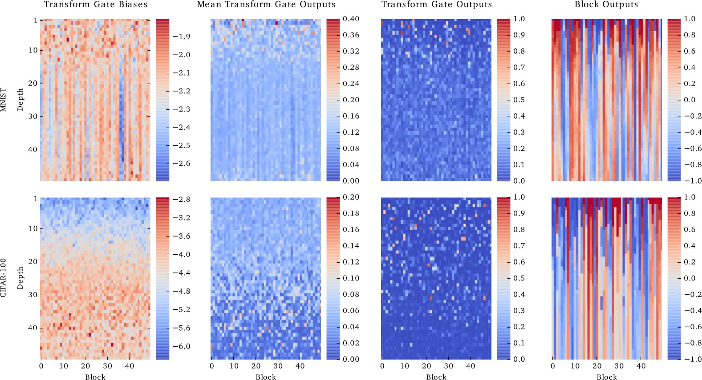

class: title
## NPFL114, Lecture 09

# Recurrent Neural Networks III, Machine Translation

.author[
Milan Straka
]

---
class: middle, center
# RNN Cells

# RNN Cells

---
class: middle, center
# Basic RNN Cell

---
class: middle, center
# LSTM Cell

---
class: middle, center
# LSTM Cell

---
class: middle, center
# LSTM Cell

---
class: middle, center
# LSTM Cell

---
class: middle, center
# LSTM Cell

---
class: middle, center
# LSTM Cell

---
class: middle, center
# GRU Cell

---
class: middle, center
# Highway Networks

# Highway Networks

---
class: middle, center
# Highway Networks

# Highway Networks

---
# Highway Networks

For input $→x$, fully connected layer computes
$$→y ← H(→x, ⇉W\_H).$$

--

Highway networks add residual connection with gating:
$$→y ← H(→x, ⇉W\_H) \cdot T(→x, ⇉W\_T) + →x \cdot (1 - T(→x, ⇉W\_T)).$$

--

Usually, the gating is defined as
$$T(→x, ⇉W\_T) ← σ(⇉W\_T →x + →b\_T).$$

---
class: middle
# Highway Networks

---
class: middle
# Highway Networks

---
class: middle
# Highway Networks

