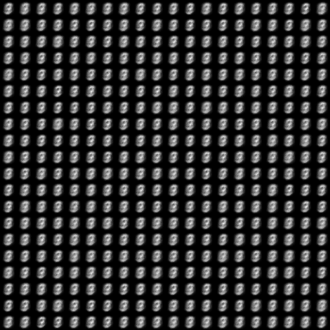
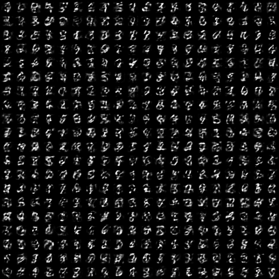
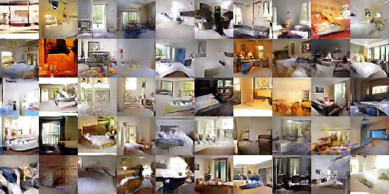
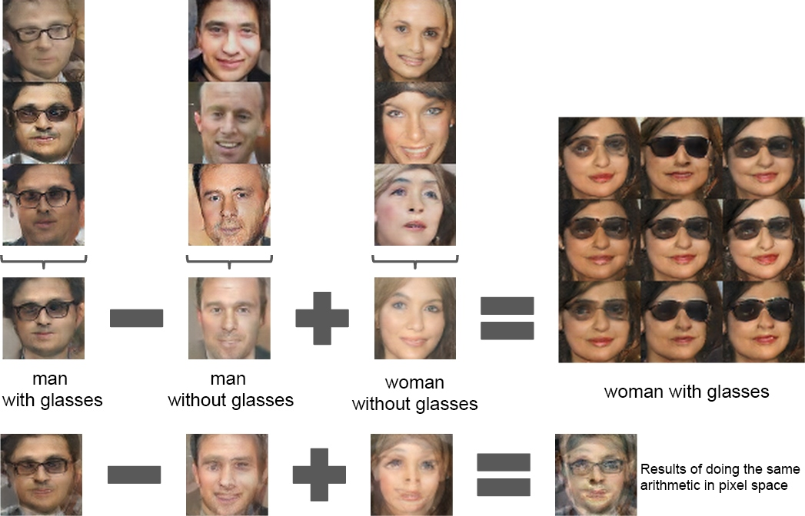
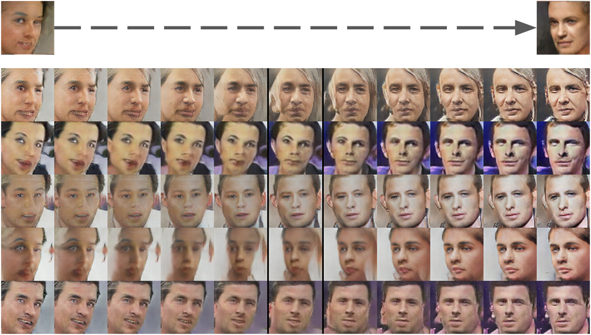
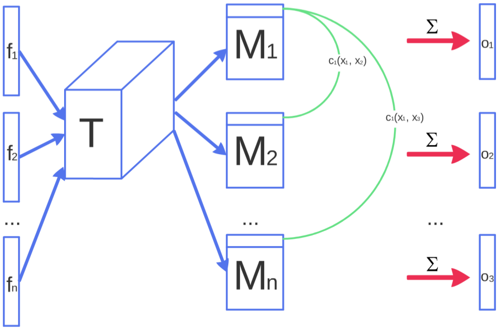
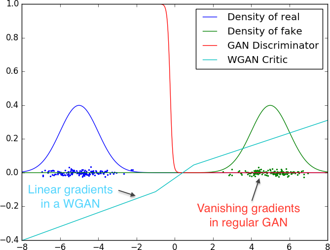

class: title
## NPFL114, Lecture 10

# Deep Generative Models

.author[
Milan Straka
]

---
# Generative Models

Generative models are given a set $\mathcal X$ of realizations of a random
variable $⁇→x$ and their goal is to estimate $P(→x)$.

Usually the goal is to be able to sample from $P(⁇→x)$, but sometimes an
explicit calculation of $P(→x)$ is also possible.

---
# Deep Generative Models

One possible approach to estimate $P(→x)$ is to assume that the random variable
$⁇→x$ depends on a _latent variable_ $⁇→z$:
$$P(→x) = P(→z) P(→x | →z).$$

--

We will use neural networks to estimate the conditional probability with
$P\_→θ(→x | →z)$.

---
# AutoEncoders

--
- unsupervised feature extraction

- input compression

- when $→x + →ε$ is used as input, autoencoders can perform denoising

---
# Variational AutoEncoders

We assume $P(⁇→z)$ is fixed and independent on $⁇→x$.

We will approximate $P(→x | →z)$ using $P\_→θ(→x | →z)$. However, in order
to train an autoencoder, we need to know the posterior $P\_→θ(→z | →x)$, which is usually
intractable.

--

We will therefore approximate $P\_→θ(→z | →x)$ by a trainable $Q\_→φ(→z | →x)$.

---
# Variational AutoEncoders

Let us define _variational lower bound_ or _evidence lower bound_ (ELBO),
denoted $\mathcal{L}(→θ, →φ;⁇→x)$, as
$$\mathcal{L}(→θ, →φ;⁇→x) = \log P\_→θ(→x) - D\_\textrm{KL}(Q\_→φ(→z | →x) || P\_→θ(→z | →x)).$$

--
Because KL-divergence is non-negative, $\mathcal{L}(→θ, →φ;⁇→x) ≤ \log P\_→θ(→x).$

--

By using simple properties of conditional and joint probability, we get that
$$\begin{aligned}
\mathcal{L}(→θ, →φ;⁇→x) &= 𝔼\_{Q\_→φ(→z | →x)} [\log P\_→θ(→x) + \log P\_→θ(→z | →x) - \log Q\_→φ(→z | →x)] \\\
                        &= 𝔼\_{Q\_→φ(→z | →x)} [\log P\_→θ(→x, →z) - \log Q\_→φ(→z | →x)] \\\
                        &= 𝔼\_{Q\_→φ(→z | →x)} [\log P\_→θ(→x | →z) + \log P\_→θ(→z) - \log Q\_→φ(→z | →x)] \\\
                        &= 𝔼\_{Q\_→φ(→z | →x)} [\log P\_→θ(→x | →z)] - D\_\textrm{KL}(Q\_→φ(→z | →x) || P\_→θ(→z)).
\end{aligned}$$

---
# Variational AutoEncoders

In order to derivate through $→z∼Q\_→φ(→z | →x)$, note that if
$$→z ∼ \mathcal{N}(→μ, →σ^2),$$
we can write $→z$ as
$$→z ∼ →μ + →σ \cdot \mathcal{N}(0, 1).$$
Such formulation then allows differentiating $→z$ with respect to
$→μ$ and $→σ$.

---
class: middle
# Variational AutoEncoders

---
class: middle
# Variational AutoEncoders

---
class: center
# VAE – Too High Latent Loss

---
class: center
# VAE – Too High Reconstruction Loss

---
# Generative Adversarial Networks

We have a _generator_, which given $→z ∼ P(⁇→z)$ generates data $→x$.

We denote the generator as $G(→z; →θ\_g)$.

--

Then we have a _discriminator_, which given data $→x$ generates a probability
whether $→x$ comes from real data or is generated by a generator.

We denote the discrimininator as $D(→x; →θ\_d)$.

--

In other words, D and G play the following game:
$$\min\_G \max\_D 𝔼\_{→x ∼ P\_\textrm{data}}[\log D(→x)] + 𝔼\_{→z ∼ P(⁇→z)}[\log (1 - D(G(→z)))].$$

---
class: middle
# Generative Adversarial Networks

---
class: middle
# Generative Adversarial Networks

---
class: center, middle
# Generative Adversarial Networks

---
class: middle
# Deep Convolutional GAN

---
class: middle
# Deep Convolutional GAN

---
class: middle
# Deep Convolutional GAN

---
class: middle
# Deep Convolutional GAN

---
class: center
# Deep Convolutional GAN

---
class: middle
# Deep Convolutional GAN

---
class: middle
# Deep Convolutional GAN

---
class: middle
# Deep Convolutional GAN

---
# GANs are Problematic to Train

- Feature matching

- Minibatch discrimination

- Historical averaging

- Label smoothing

---
class: middle
# Minibatch Discrimination

---
class: center
# Wasserstein GAN

---
class: middle
# Wasserstein GAN

---
class: middle
# Wasserstein GAN

